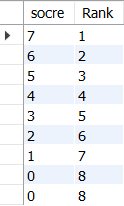
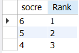

[原题链接](https://leetcode-cn.com/problems/rank-scores/)

---

## 0x0 题目详情

编写一个 SQL 查询来实现分数排名。

如果两个分数相同，则两个分数排名（Rank）相同。请注意，平分后的下一个名次应该是下一个连续的整数值。换句话说，名次之间不应该有“间隔”。

+----+-------+
| Id | Score |
+----+-------+
| 1  | &nbsp;3.50&nbsp;&nbsp;  |
| 2  | &nbsp;3.65&nbsp;&nbsp;  |
| 3  | &nbsp;4.00&nbsp;&nbsp;  |
| 4  | &nbsp;3.85&nbsp;&nbsp;  |
| 5  | &nbsp;4.00&nbsp;&nbsp;  |
| 6  | &nbsp;3.65&nbsp;&nbsp;  |
+----+-------+
例如，根据上述给定的 Scores 表，你的查询应该返回（按分数从高到低排列）：

+-------+------+
| Score | Rank |
+-------+------+
| 4.00  | &nbsp;&nbsp;&nbsp;&nbsp;1&nbsp;&nbsp;&nbsp;&nbsp;&nbsp;&nbsp;|
| 4.00  | &nbsp;&nbsp;&nbsp;&nbsp;1&nbsp;&nbsp;&nbsp;&nbsp;&nbsp;&nbsp;|
| 3.85  | &nbsp;&nbsp;&nbsp;&nbsp;2&nbsp;&nbsp;&nbsp;&nbsp;&nbsp;&nbsp;|
| 3.65  | &nbsp;&nbsp;&nbsp;&nbsp;3&nbsp;&nbsp;&nbsp;&nbsp;&nbsp;&nbsp;|
| 3.65  | &nbsp;&nbsp;&nbsp;&nbsp;3&nbsp;&nbsp;&nbsp;&nbsp;&nbsp;&nbsp;|
| 3.50  | &nbsp;&nbsp;&nbsp;&nbsp;4&nbsp;&nbsp;&nbsp;&nbsp;&nbsp;&nbsp;|
+-------+------+


## 0x1 解题思路

这道题采用局部变量的方法,我也是第一次采用的,高级高级。我们先给每行初始化一个`Rank`变量。给rank赋值的逻辑就比较简单了。

如果前一行的分数等于当前行,那么rank不变,否则rank加1,当然这样操作的前提是需要先对Score字段排序。当时对于这段sql是如何正确运行的困扰了我很长时间。

我的问题:首先`order by`是在`select`后面直面,但是实现正确的rank又需要先排序,所以这段代码到底是怎么执行的?

答案:之前我一直以为在order之前Rank字段的值就已经计算好了,但是事实并不是这样,以下面的代码为例作为讲解(与原题无关):

``` sql
SELECT socre, cast(CASE
WHEN @pre = socre THEN @rk + 0
WHEN (@pre := socre) is not null THEN @rk := @rk + 1
END as signed)AS `Rank`
FROM Score, (SELECT @pre := NULL, @rk := 0) AS init
ORDER BY socre DESC;
```
结果如下：



如果在最后加上limit,因为limit是最后执行的,我们再来看看结果:

``` sql
SELECT socre, cast(CASE
WHEN @pre = socre THEN @rk + 0
WHEN (@pre := socre) is not null THEN @rk := @rk + 1
END as signed)AS `Rank`
FROM Score, (SELECT @pre := NULL, @rk := 0) AS init
ORDER BY socre DESC
limit 1,3;
```

结果如下：



神奇的结果出现了,我们发现是先limit再计算Rank的。因为如果是先计算Rank,那么limit后的Rank应该从2开始,而结果是从1开始。所以说明:变量是在limit之后赋值的。


## 0x2 代码实现

``` sql
# Write your MySQL query statement below
SELECT Score, cast(CASE
WHEN @pre = Score THEN @rk + 0
WHEN @pre := Score THEN @rk := @rk + 1
ELSE @rk := @rk + 1
END as signed)AS `Rank`
FROM Scores, (SELECT @pre := NULL, @rk := 0) AS init
ORDER BY Score DESC;
```

这里首先简单说明以下语法规则:MySQL中变量符号以`@`开头,`:=`表示对局部变量赋值。首先会执行from语句,这里会将Score表中的每一行加上一个新字段,也就是`Rank`。

下面这一句可以看做对每一行新添加的局部变量做初始化。
>(SELECT @pre := NULL, @rk := 0) AS init

还有一点需要注意：

>WHEN @pre := Score THEN @rk := @rk + 1

这句比较特殊,按道理来说,when中应该执行的是条件语句,而这里却给了一个赋值语句,那么赋值结果如果是0的话,再进行逻辑判断的结果就是`false`,自然不会执行后面的`then`语句。这样如果分数中出现零分,就不会实现正确的Rank排名。

这里比较笨拙的办法就是加一句else,在后面加一句`else`,把刚才没有执行`then`部分补上(因为上一句并没有成功执行,自然会走到else)。ok,这样就修复了0分的情况。

**还有一点需要注意**:

这里因为`Score`是浮点数,所以计算出来的`Rank`也是浮点数,所以需要强制将`Rank`向下转型。

---

下面是一种不用加else的方法,就是在赋值完成,就直接判断局部变量是否为`null`,因为`null`和0还是不等的,所以如果为0分还是会执行后面的`then`语句。

``` sql
# Write your MySQL query statement below
SELECT Score, cast(CASE
WHEN @pre = Score THEN @rk + 0
WHEN (@pre := Score) is not null THEN @rk := @rk + 1
END as signed)AS `Rank`
FROM Scores, (SELECT @pre := NULL, @rk := 0) AS init
ORDER BY Score DESC;
```

## 0x3 课后总结

嗯,sql语句里的局部变量还是第一次用到。

