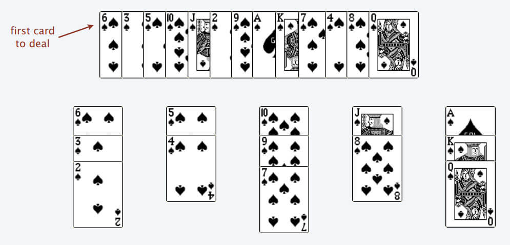

[原题链接](https://leetcode-cn.com/problems/longest-increasing-subsequence)

---

### 0x0 题目详情

>给定一个无序的整数数组，找到其中最长上升子序列的长度。

---

**测试用例:**

>示例:
输入: [10,9,2,5,3,7,101,18]
输出: 4 
解释: 最长的上升子序列是 [2,3,7,101]，它的长度是 4。

>说明:
可能会有多种最长上升子序列的组合，你只需要输出对应的长度即可。
你算法的时间复杂度应该为 O(n2) 。

>进阶: 你能将算法的时间复杂度降低到 O(n log n) 吗?

### 0x1 解题思路

不知道是否还记得我总结的关于字符串的dp问题。这道题的灵感来自于对字符串的每个分割点进行切分。

**初阶做法:**
我们随意选定一个下标`i`,想求以`nums[i]`结尾的最长上升子序列,那么我们就需要在`i`之前找到位置`j`,使以`nums[j]`为结尾的最长的子序列最长,并且`nums[i]`能够拼接在`nums[j]`后面。那么问题就简单了,定义一个dp数组,`dp[i]`表示以`nums[i]`结尾的最长上升子序列。这仅仅是初阶做法。

**高级做法:**

我们想要实现O(nlogn)的复杂度,很容易就想到二分可能是一种方法。那么就得在如何找我们想要的`nums[j]`上面下功夫。这里要用到耐心排序的方法。我这里也是拿来主义,别人讲的比较好:

---

为了简单起见，后文跳过所有数学证明，通过一个简化的例子来理解一下算法思路。

首先，给你一排扑克牌，我们像遍历数组那样从左到右一张一张处理这些扑克牌，最终要把这些牌分成若干堆。并且每一堆都是有序的。


处理这些扑克牌要遵循以下规则：

只能把点数小的牌压到点数比它大的牌上；如果当前牌点数较大没有可以放置的堆，则新建一个堆，把这张牌放进去；如果当前牌有多个堆可供选择，则选择最左边的那一堆放置。

比如说上述的扑克牌最终会被分成这样 5 堆（我们认为纸牌 A 的牌面是最大的，纸牌 2 的牌面是最小的）。



为什么遇到多个可选择堆的时候要放到最左边的堆上呢？因为这样可以保证牌堆顶的牌有序（2, 4, 7, 8, Q），证明略。


按照上述规则执行，可以算出最长递增子序列，牌的堆数就是最长递增子序列的长度，证明略。


我们只要把处理扑克牌的过程编程写出来即可。每次处理一张扑克牌不是要找一个合适的牌堆顶来放吗，牌堆顶的牌不是有序吗，这就能用到二分查找了：用二分查找来搜索当前牌应放置的位置。

作者：labuladong
链接：https://leetcode-cn.com/problems/longest-increasing-subsequence/solution/dong-tai-gui-hua-she-ji-fang-fa-zhi-pai-you-xi-jia/

---

对于耐心排序找堆的过程,我们的目标是找到一个堆的堆顶`x`跟待插入的数据`y`差距最小,对于每个堆,都有堆顶`x`>=`y`

第一次听说耐心排序,查了一下,说它是插入排序的改进。好的,又学会一种新的算法了。:)

### 0x2 代码实现

普通做法:

``` java
class Solution {
    public int lengthOfLIS(int[] nums) {
        if(nums==null || nums.length==0){
            return 0;
        }
        int[] dp=new int[nums.length];
        //dp[i]表示以i结尾的最长上升子序列
        dp[0]=1;
        int length=nums.length;
        int result=1;
        for(int i=1;i<length;i++){
            dp[i]=1;
            for(int j=0;j<i;j++){
                if(nums[j]>=nums[i]){
                    continue;
                }
                dp[i]=Math.max(dp[i],dp[j]+1);
            }
            result=Math.max(result,dp[i]);

        }
        return result;

    }
}
```

---

进阶做法:

``` java
class Solution {
    public int lengthOfLIS(int[] nums) {

    if(nums==null || nums.length==0){
        return 0;
    }
    int[] top=new int[nums.length];
    int count=0;
    for(int i=0;i<nums.length;i++){
        int left=0;
        int right=count;
        while(left<right){
            int mid=left+(right-left)/2;
            if(top[mid]>=nums[i]){
                right=mid;
            }else{
                left=mid+1;
            }
        }
        top[left]=nums[i];
        if(left==count){
            count++;
        }
    }
    return count;

    }
}

```

### 0x3 课后总结

找到一个位置i,推算出如何从位置j计算出位置i,嗯,学会了。

还有耐心排序。