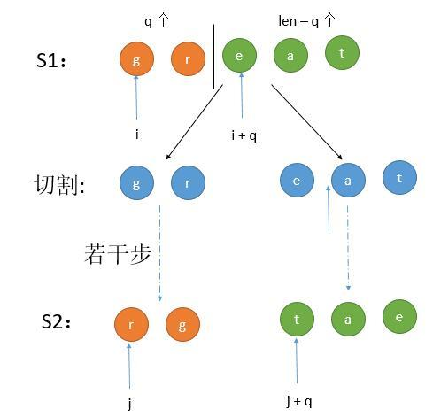

[原题链接](https://leetcode-cn.com/problems/scramble-string/)

---

### 0x0 题目详情

给定一个字符串 s1，我们可以把它递归地分割成两个非空子字符串，从而将其表示为二叉树。
下图是字符串 s1 = "great" 的一种可能的表示形式。

        great
        /    \
       gr    eat
      / \    /  \
     g   r  e   at
                / \
               a   t

在扰乱这个字符串的过程中，我们可以挑选任何一个非叶节点，然后交换它的两个子节点。
例如，如果我们挑选非叶节点 "gr" ，交换它的两个子节点，将会产生扰乱字符串 "rgeat" 。

        rgeat
       /    \
      rg    eat
     / \    /  \
    r   g  e   at
              / \
             a   t

我们将 "rgeat” 称作 "great" 的一个扰乱字符串。
同样地，如果我们继续交换节点 "eat" 和 "at" 的子节点，将会产生另一个新的扰乱字符串 "rgtae" 。

        rgtae
       /    \
      rg    tae
     / \    /  \
    r   g  ta  e
          / \
         t   a
我们将 "rgtae” 称作 "great" 的一个扰乱字符串。

给出两个长度相等的字符串 s1 和 s2，判断 s2 是否是 s1 的扰乱字符串。

---

**测试用例:**

>示例 1:
输入: s1 = "great", s2 = "rgeat"
输出: true

>示例 2:
输入: s1 = "abcde", s2 = "caebd"
输出: false

### 0x1 解题思路

这道题真的把我看傻了,暴力解都不知道咋写。网上比较普遍的解法如下:

1. 首先字符串`s1`和字符串`s2`的长度必须相同,否则二者不可能是扰乱字符串
2. 字符串`s1`和字符串`s2`中的字符种类以及每种字符的个数必须相同,否则同理,二者不可能是扰乱字符串
3. 最终的两步如下:
    - 我们先任意找到一个切割点,下图以`r`、`e`之间为切割点:
    
    可以发现,一个字符串被扰乱之后,只有`s1`的左半部分经过种种扰乱能够变为字符串`s2`的左半部分。而又半部分没有扰乱。所以只需要递归`s1`的左半部分与`s2`的左半部分查看是否能够扰乱成功。同理,如果扰乱的部分在`s1`的右半部分,只需要递归判断`s1`的右半部分与`s2`的右半部分即可。**我们可以把这种情况称之为左对左,右对右**
    - 当然还有第二种情况:把`s1`的左半部分扰乱后的结果对应`s2`的右半部分(要求`s1`和`s2`是相同切割点),如下图所示:
    
    所以在递归时需要判断`s1`的左半部分与`s2`的右半部分(**要求长度相同**),或者递归判断`s1`的右半部分与`s2`的左半部分,当然也要求长度相同。

这道题从递归改动态规划有点困难,具体在代码实现部分讲解。

### 0x2 代码实现

递归版本:
``` java
class Solution {
    public boolean isScramble(String s1, String s2) {
        //如果长度不等,不可能是扰乱字符串
        if(s1.length()!=s2.length()){
            return false;
        }
        if(s1.equals(s2)){
            return true;
        }
        int[] letters=new int[26];
        for(int i=0;i<s1.length();i++){
            letters[s1.charAt(i)-'a']++;
            letters[s2.charAt(i)-'a']--;
        }
        for(int i=0;i<letters.length;i++){
            if(letters[i]!=0){
                return false;
            }
        }
        
        int length=s1.length();
        //如果i<length-1,substring(0,length-1)并不能取到最后一个字符
        for(int i=1;i<length;i++){
            if(isScramble(s1.substring(0,i),s2.substring(0,i))&& isScramble(s1.substring(i),s2.substring(i))){
                return true;
            }
            if(isScramble(s1.substring(0,i),s2.substring(length-i))&& isScramble(s1.substring(i),s2.substring(0,length-i))){
                return true;
            }
        }
        return false;
    }
}

```

---

动态规划版本:

这是递归版本的核心代码:

``` java
...
int length=s1.length();
//遍历每个切割点
for(int i=1;i<length;i++){
    if(isScramble(s1.substring(0,i),s2.substring(0,i))&& isScramble(s1.substring(i),s2.substring(i))){
        return true;
    }
    if(isScramble(s1.substring(0,i),s2.substring(length-i))&& isScramble(s1.substring(i),s2.substring(0,length-i))){
        return true;
    }
}
```

注意:在求length时,这里的字符串`s1`每一次递归都是不一样的,需要根据当时递归传进去的字符串求值,不是一个固定值。
所以在上面代码的最外层还得套一层跟字符串`s1`长度相关的循环,从而能够模拟递归。

``` java
int length=s1.length();//这里就是原始字符串s1的长度
//这里的len表示的是字符串s1的左半部分长度,需要遍历每个切割点嘛
for(int len=1;len<=length;len++){

    ...
    //下面的代码还需要改造成动态规划的样子
    for(int i=1;i<length;i++){
        if(isScramble(s1.substring(0,i),s2.substring(0,i))&& isScramble(s1.substring(i),s2.substring(i))){
            return true;
        }
        if(isScramble(s1.substring(0,i),s2.substring(length-i))&& isScramble(s1.substring(i),s2.substring(0,length-i))){
            return true;
        }
    }

}
```

这里[盗张图](https://segmentfault.com/a/1190000021930016):


跟递归思路还是很像的,假如我们当前处理的子字符串长度为q,那么就分为左对左、右对右或者交叉情况。

这里就得使用两个变量i、j表示字符串`s1`、`s2`的下标。表示从`i`开始q个长度与从`j`开始q个长度是否符合规则。所以dp数组是个三维的,dp[len][p][q],表示从p和q开始,[p,p+len)、[q,q+len)是否符合规则。

更新(2020-08-05 22:28:47):
我一直不懂为什么设置i和j两个变量来分别表示`s1`和`s2`的下标,递归中用的不都是同一个i吗?这一点困扰了我很长很长时间。but,我刚才简单模拟了一下递归的过程后,确实出现了`s1`和`s2`每个下标的两两匹配。

比如当长度len为2时,q的值可以为1和2,那么四次调用递归函数时,s1和s2的字串下标范围为:

     s1    s2
    [0,1),[0,1)
    [1,2),[1,2)
    [0,1),[1,2)
    [1,2),[0,1)
可以看到,s1的每个下标i都与s2的每个下标j进行了两两匹配

``` java
class Solution {
    public boolean isScramble(String s1, String s2) {
        //如果长度不等,不可能是扰乱字符串
        if(s1.length()!=s2.length()){
            return false;
        }
        if(s1.equals(s2)){
            return true;
        }
        int[] letters=new int[26];
        for(int i=0;i<s1.length();i++){
            letters[s1.charAt(i)-'a']++;
            letters[s2.charAt(i)-'a']--;
        }
        for(int i=0;i<letters.length;i++){
            if(letters[i]!=0){
                return false;
            }
        }
        int length=s1.length();
        boolean[][][] dp=new boolean[length+1][length][length];
        for(int len=1;len<=length;len++){
            for(int i=0;i+len<=length;i++){
                for(int j=0;j+len<=length;j++){
                    if(len==1){
                        dp[len][i][j]=s1.charAt(i)==s2.charAt(j);
                    }else{
                        for(int p=1;p<len;p++){
                            dp[len][i][j]=(dp[p][i][j] && dp[len-p][i+p][j+p])
                            ||
                            dp[p][i][j+len-p] && dp[len-p][i+p][j];
                            if(dp[len][i][j]){
                                break;
                            }
                        }
                    }
                }
            }
        }
        return dp[length][0][0];
    }
}

```


### 0x3 课后总结