[原题链接](https://leetcode-cn.com/problems/jump-game/)

### 0x1 题目详情

>给定一个非负整数数组，你最初位于数组的第一个位置。
数组中的每个元素代表你在该位置可以跳跃的最大长度。
判断你是否能够到达最后一个位置。

---

> **测试用例:**
示例 1:
输入: [2,3,1,1,4]
输出: true
解释: 我们可以先跳 1 步，从位置 0 到达 位置 1, 然后再从位置 1 跳 3 步到达最后一个位置。

### 0x2 解题思路

**思路1**：

我刚开始的思路是通过暴力递归求解，但是显而易见，这个递归是无后效性的，也就是当前跳几步和之前怎么跳过来的完全没有关系。递归的思路就是每到达一个点，就依次从大到小尝试可以跳跃的步数，如果跳跃后的索引能够到达最后，那么就表示我们是能够跳成功的。当然递归肯定是不会通过的，改成动态规划后能够低空飘过。

**思路2**:

第二种思路是看答题区得来的。就是我们需要维护一个当前能够到达的最大索引，如果最大索引能够超过最后一个位置，那么表示成功找到路径。否则如果当`index>maxIndex`时，表示我们当前index的位置我们是无论如何都不能到达的，自然返回false。贪心的具体解释见下图：


这是一种贪心的思路，以前没咋做过贪心的题目，这个贪心到底咋贪啊？

**思路3:**

思路2是从前往后遍历，而这种思路是从后往前遍历，如果当前元素不为0，那么是一定能够到达当前位置的。如果当前元素nums[j]为0，那么就在该元素之前查找是否有元素满足`nums[i]>i-j`,即是否有元素能直接跳过0元素。如果没有找到，则返回false。

### 0x3 代码实现

**思路1:**复杂度为$O(N^2)$

``` java "递归"
class Solution {
    public boolean canJump(int[] nums) {

        if(nums==null || nums.length<2){
            return true;
        }
        return recur(nums,0);
    }

    boolean recur(int[] nums,int index){
        if(index==nums.length-1){
            return true;
        }
        if(index>=nums.length){
            return false;
        }
        if(nums[index]==0){
            return false;
        }
        //尝试跳1~nums[index]次
        boolean result=false;
        for(int i=nums[index];i>0;i--){
            result|=recur(nums,index+i);
            if(result==true){
                break;
            }
        }
        return result;
    }
}

```

---
通过递归改过来的动态规划。

``` java "动态规划思路"
class Solution {
    public boolean canJump(int[] nums) {

        if(nums==null || nums.length<2){
            return true;
        }
        return recur(nums,0);
    }

    boolean recur(int[] nums,int index){
        //dp数组表示从i位置跳能否成功
        boolean[] dp=new boolean[nums.length];
        dp[nums.length-1]=true;

        for(int i=dp.length-2;i>=0;i-- ){
            // boolean result=false;
            //nums[i]表示能跳的步数
            for(int j=nums[i];j>0;j--){
                if((i+j)>=dp.length){
                    continue;
                }
                dp[i]|=dp[i+j];
                if(dp[i]==true){
                    break;
            }
        }
        }
        return dp[0];
    }

}

```

---

**思路2:**,复杂度为$O(N)$

``` java "贪心思路"
class Solution {
    public boolean canJump(int[] nums) {
        if(nums== null || nums.length<2){
            return true;
        }
        boolean result=false;
        int maxIndex=0;
        for(int i=0;i<nums.length-1;i++){
            //如果最大索引不能到达当前位置，表示最后结果为false，不能到达最后一个位置
            if(i>maxIndex){
                return false;
            }
            maxIndex=Math.max(i+nums[i],maxIndex);
            //提前终止循环
            if(maxIndex>=nums.length-1){
                result=true;
                break;
            }
        }
        return result;
    }
}

```

### 0x4 课后总结

总的来说呢我对做贪心的题目没啥经验感觉全靠猜啊，以后在慢慢总结把，感觉没啥套路啊。
