[原题链接](https://leetcode-cn.com/problems/reverse-nodes-in-k-group/)

### 0x0 题目详情

>给你一个链表，每 k 个节点一组进行翻转，请你返回翻转后的链表。
k 是一个正整数，它的值小于或等于链表的长度。
如果节点总数不是 k 的整数倍，那么请将最后剩余的节点保持原有顺序。

---

**测试用例:**

>示例：
给你这个链表：1->2->3->4->5
当 k = 2 时，应当返回: 2->1->4->3->5
当 k = 3 时，应当返回: 3->2->1->4->5

>说明：
你的算法只能使用常数的额外空间。
你不能只是单纯的改变节点内部的值，而是需要实际进行节点交换。

### 0x1 解题思路

这道题还是比较简单的，就是一些小细节需要注意。就是k个一组，然后把长度为k的链表反转就行了。没啥难度。思路可以看看下图：



### 0x2 代码实现

``` java
/**
 * Definition for singly-linked list.
 * public class ListNode {
 *     int val;
 *     ListNode next;
 *     ListNode(int x) { val = x; }
 * }
 */
class Solution {
    public ListNode reverseKGroup(ListNode head, int k) {
        if(head==null || head.next==null){
            return head;
        }
        int count=0;

        ListNode next=null;
        ListNode dummy=new ListNode(-1);
        dummy.next=head;
        ListNode current=dummy;
        ListNode pre=dummy;
        while(current!=null){
            //这里有一个注意的点：就是将current右移后，current有可能变为null,但是count却达到了k，所以在if中需要额外判断一下
            current=current.next;
            count++;
            //遇到一组节点了
            if(count%k==0&& current!=null){
                count=0;
                next=current.next;
                current.next=null;
                ListNode oldHead=pre.next;
                pre.next= reverse(pre.next);
                pre=oldHead;
                oldHead.next=next;
                current=oldHead;
            }
        }
        return dummy.next;
    }
    private ListNode reverse(ListNode head){
        ListNode pre=null;
        ListNode next=null;
        while(head!=null){
            next=head.next;
            head.next=pre;
            pre=head;
            head=next;
        }
        return pre;
    }
}

```

### 0x3 课后总结

链表的基本操作。