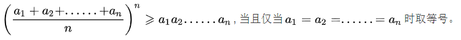

[原题链接](https://leetcode-cn.com/problems/integer-break)

---

### 0x0 题目详情

给定一个正整数 n，将其拆分为至少两个正整数的和，并使这些整数的乘积最大化。 返回你可以获得的最大乘积。

---

**测试用例:**

>示例 1:
输入: 2
输出: 1
解释: 2 = 1 + 1, 1 × 1 = 1。

>示例 2:
输入: 10
输出: 36
解释: 10 = 3 + 3 + 4, 3 × 3 × 4 = 36。

>说明: 你可以假设 n 不小于 2 且不大于 58。

### 0x1 解题思路

这道题虽然打着动态规划的标签,但实际上用数学方法更快。

**数学方法:**

对于一个数`num=x+y`拆成两个整数的话,`x`和`y`的差值越小`x`与`y`的乘积才会越大。例如增大`x`与`y`的差值(假设x>=y)。`num=(x+1)+(y-1)`,`(x+1)*(y-1)=xy-(x-y)-1<xy`。所以如果要把一个数拆成两个两个整数,那么这两个数的差值越小越小,最好是`x==y`。

那么把一个数拆成n个整数的是一样的,最好的情况是这n个数相等。



那么最完美的情况就是每个拆分后的数为(n/x)。最后的乘积为`(n/x)^n`。对该函数求导,当`x=n/e`时乘积最大。那么每段的长度为`e`时,乘积最大。离`e`最近的整数为`3`。所以我们需要把数`n`拆成尽可能多的3。

但是上述规则只适用于n>=4,当n<=4时,拆分后的最大乘积为(n-1)。

**暴力递归方法:**

对于一个数`n`我们可以拆成两部分`x`和`y`。我们可以选择拆分或者不拆分`x`或者`y`。那么拆分后的最大乘积就会有四种情况(假设`x`拆分后的最大乘积为`left`,`y`拆分后的最大乘积为`right`):

- x*y
- x*right
- left*right
- left*y

最后拆分后的最大值在这四者中选一个最大的。

那么对于数`n`,我们有`n-1`个拆分点。又是拆分点,跟字符串的dp有点像了奥。

### 0x2 代码实现

**数学方法:**

``` java
class Solution {
    public int integerBreak(int n) {
        if(n<4){
            return n-1;
        }
        int result=1;
        while(n>4){
            result*=3;
            n-=3;
        }
        return result*n;

    }
}

```

---

**递归方法:**

``` java
class Solution {
   
    public int integerBreak(int n) {
        if(n<=2){
            return 1;
        }
        
        return recur(n);
    }

    private int recur(int n){

        int result=0;
        if(n==1){
            return 1;
        }
        for(int i=1;i<=n/2;i++){
            int left=integerBreak(i);
            int right=integerBreak(n-i);
            
            result=Math.max(Math.max(i*(n-i),left*right),result);
            result=Math.max(i*right,result);
            result=Math.max(left*(n-i),result);
        }
        return result;
    }

}

```

---

**动态规划:**

``` java
class Solution {
   
    public int integerBreak(int n) {
        if(n<=2){
            return 1;
        }
        
        return recur(n);
    }

    private int recur(int n){
        int[] dp=new int[n+1];
        dp[1]=1;
        for(int i=2;i<=n;i++){
            dp[i]=i-1;
            for(int j=1;j<=i/2;j++){
                dp[i]=Math.max(Math.max(j*(i-j),dp[j]*dp[i-j]),dp[i]);
                dp[i]=Math.max(j*dp[i-j],dp[i]);
                dp[i]=Math.max(dp[i-j],dp[i]);
            }
        }
        return dp[n];
    }
}

```
### 0x3 课后总结

拆分整数、割绳子都是一类问题。