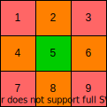

[原题链接](https://leetcode-cn.com/problems/android-unlock-patterns)

---

### 0x0 题目详情

>我们都知道安卓有个手势解锁的界面，是一个 3 x 3 的点所绘制出来的网格。
给你两个整数，分别为 ​​m 和 n，其中 1 ≤ m ≤ n ≤ 9，那么请你统计一下有多少种解锁手势，是至少需要经过 m 个点，但是最多经过不超过 n 个点的。

>先来了解下什么是一个有效的安卓解锁手势:
每一个解锁手势必须至少经过 m 个点、最多经过 n 个点。
解锁手势里不能设置经过重复的点。
假如手势中有两个点是顺序经过的，那么这两个点的手势轨迹之间是绝对不能跨过任何未被经过的点。
经过点的顺序不同则表示为不同的解锁手势。


 

>解释:
| 1 | 2 | 3 |
| 4 | 5 | 6 |
| 7 | 8 | 9 |

>无效手势：4 - 1 - 3 - 6
连接点 1 和点 3 时经过了未被连接过的 2 号点。

>无效手势：4 - 1 - 9 - 2
连接点 1 和点 9 时经过了未被连接过的 5 号点。

>有效手势：2 - 4 - 1 - 3 - 6
连接点 1 和点 3 是有效的，因为虽然它经过了点 2 ，但是点 2 在该手势中之前已经被连过了。

>有效手势：6 - 5 - 4 - 1 - 9 - 2
连接点 1 和点 9 是有效的，因为虽然它经过了按键 5 ，但是点 5 在该手势中之前已经被连过了。

 ---

**测试用例:**

>示例:
输入: m = 1，n = 1
输出: 9


### 0x1 解题思路

键盘上的9个键能够产生的连线情况可以分为两种:

- 两个键之间不会经过第三个键
- 两个键之间会经过第三个键

其中会经过第三个键的连线总共有8中小情况:

- (1,3)、(3,9)、(,9,7)、(7,1)
- (2,8)、(4,6)、(1,9)、(3,7)

注意每种情况实际是**两条线**,上面第二类的连线都会经过**键5**。那么我们就可以把按键分为三类,如下图所示:




- 1、3、7、9为一组。因为这四个键都在边角。

- 2、4、6、8为一组,因为这四个键都在中间

- 5单独为一组

对于一个键x,它可以选择剩下的八个键作为下一个目的地y,但是如果(x,y)之间有第三个键,就需要判断这第三个键是否已经被访问过。

并且这9个键都可以作为路径起始点,但是由于1、3、7、9是一类点,2、4、6、8是一类点。5是一类点。所以我们只需要求从键1开始出发的路径总数然后乘四即可。对于键2也是类似。最后单独求从键5出发的路径数。


### 0x2 代码实现

``` java
class Solution {
    public int numberOfPatterns(int m, int n) {
        if(m>n){
            return 0;
        }
        if(n>9){
            return 0;
        }
        int[][] jumps=new int[10][10];
        //下面两个键之间会经过第三个键的情况,如果jumps[i][j]==0,表示不会经过第三个键
        jumps[1][9]=jumps[9][1]=5;
        jumps[2][8]=jumps[8][2]=5;
        jumps[3][7]=jumps[7][3]=5;
        jumps[4][6]=jumps[6][4]=5;
        
        jumps[1][3]=jumps[3][1]=2;
        jumps[1][7]=jumps[7][1]=4;
        jumps[3][9]=jumps[9][3]=6;
        jumps[7][9]=jumps[9][7]=8;
        boolean[] visited=new boolean[10];

        int result=0;
        for(int i=m;i<=n;i++){
            //i表示能走的步数
            //因为从i开始,就会少一步,所以剩下的只有i-1步
            result+=recur(jumps,visited,i-1,1)*4;
            result+=recur(jumps,visited,i-1,2)*4;
            result+=recur(jumps,visited,i-1,5);
        }
        return result;
    }

    //current为当前访问点
    private int recur(int[][] jumps,boolean[] visited,int steps,int current){
        if(steps==0){
            return 1;
        }
        //如果当前节点已经访问过
        if(visited[current]){
            return 0;
        }
        //设置当前节点已经访问过
        visited[current]=true;
        int result=0;
        //1~9都是下一个候选位置,实际只有8个可能位置,但是不知道当前是访问的哪个键
        //这样写代码更简洁
        for(int next=1;next<=9;next++){
            int mid=jumps[current][next];
            //首先必须判断下一个目标节点是否被访问过
            //如果被访问过,表示next键我们不能再走了
            if(!visited[next] && (mid==0 || visited[mid])){
                result+=recur(jumps,visited,steps-1,next);
            }
        }
        //恢复当前节点的未访问状态
        visited[current]=false;
        return result;
    }
}
```

### 0x3 课后总结

不看答案我能会做?