[原题链接](https://leetcode-cn.com/problems/largest-rectangle-in-histogram/)

### 0x0 题目详情

>给定 n 个非负整数，用来表示柱状图中各个柱子的高度。每个柱子彼此相邻，且宽度为 1 。
求在该柱状图中，能够勾勒出来的矩形的最大面积。

---

**测试用例:**

以上是柱状图的示例，其中每个柱子的宽度为 1，给定的高度为 [2,1,5,6,2,3]。

图中阴影部分为所能勾勒出的最大矩形面积，其面积为 10 个单位。

>示例:
输入: [2,1,5,6,2,3]
输出: 10

### 0x1 解题思路

这道题非常适合使用单调栈来解决，但是又不能完全套用单调栈模板，用到在数组**首尾处添加两个哨兵**的小技巧。方便最后当数组不为空时做清算工作。

而且这道题使用的单调递增栈，添加的哨兵值为0，值非常合适。因为高度最小为0。所以每道题添加的哨兵值要视情况而定。

具体思路见下图：



在每次弹出元素时，计算当前高度能够构成的最大矩形面积。


### 0x2 代码实现

``` java
class Solution {
    public int largestRectangleArea(int[] heights) {

        if(heights==null || heights.length==0){
            return 0;
        }
        int result=0;
        LinkedList<Integer> stack=new LinkedList<>();
        int[] back=new int[heights.length+2];
        for(int i=0;i<heights.length;i++){
            back[i+1]=heights[i];
        }

        for(int i=0;i<back.length;i++){
            //这里并不要求栈内元素严格单调自增，元素相等也可以，因为这不影响最后面积的计算
            while(!stack.isEmpty() && back[stack.peekLast()]>=back[i]){
                int curHeight=back[stack.pollLast()];
                int width=i-stack.peekLast()-1;
                result=Math.max(result,curHeight*width);
            }
            stack.offer(i);
        }
        return result;

    }
}
```

### 0x3 课后总结

单调栈题目，注意有时候可以通过添加哨兵减少代码复杂度。在递增栈中哨兵比较好使。