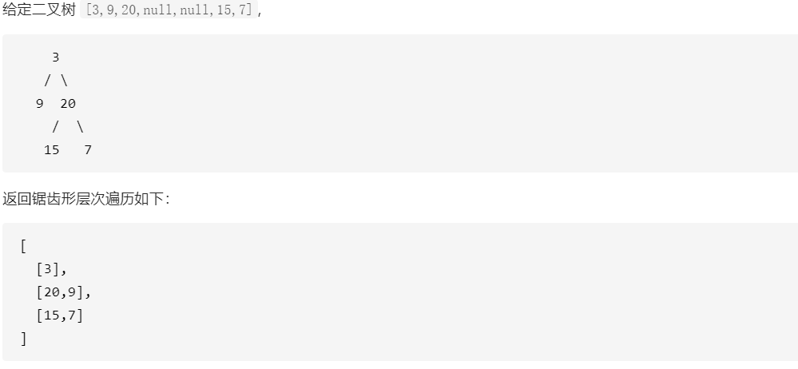

[原题链接](https://leetcode-cn.com/problems/binary-tree-zigzag-level-order-traversal/)

---

### 0x0 题目详情

给定一个二叉树，返回其节点值的锯齿形层次遍历。（即先从左往右，再从右往左进行下一层遍历，以此类推，层与层之间交替进行）。

---

**测试用例:**


### 0x1 解题思路

这道题还是比较简单的，就是层次遍历加了点逆序的花样。但是层次遍历的方法还是比较多的。我原来一直使用的方法是采用hashmap记录每个节点的层数，如果层数发生变化，表示当前已经进入新的一层，可以对上一层节点进行一些操作了，但是这么做的话感觉比较笨拙，而且有很多重复代码。我又发现了一种新方法。

我们在遍历新的一层前，我们首先获得当前层的宽度，然后当前层遍历完后，下一层已经加入队列了(这里仍然使用队列记录需要遍历的节点)。此时的队列是只包含下层节点，所以我们能够在遍历下一层之前获得下一层的准确长度。

至于这个锯齿遍历，只不过是在遍历新一层前从左开始或者从右开始，没啥新玩意。

### 0x2 代码实现

``` java
/**
 * Definition for a binary tree node.
 * public class TreeNode {
 *     int val;
 *     TreeNode left;
 *     TreeNode right;
 *     TreeNode(int x) { val = x; }
 * }
 */
class Solution {
    public List<List<Integer>> zigzagLevelOrder(TreeNode root) {
        List<List<Integer>> result=new ArrayList<>();
        if(root==null){
            return result;
        }
        LinkedList<TreeNode> queue=new LinkedList<>();
        queue.offerLast(root);
        
        int level=0;
        //每次的新循环都能获得当前层的节点数，虽然还没开始遍历,
        //因为一层遍历完成后，队列中剩下的只有新一层的全部节点
        while(!queue.isEmpty()){
            level++;
            int size=queue.size();
            ArrayList<Integer> current=new ArrayList<>();
            TreeNode currentNode=null;
            for(int i=0;i<size;i++){
                //从左向右
                if(level%2!=0){
                    currentNode=queue.pollFirst();
                    if(currentNode.left!=null){
                        queue.offerLast(currentNode.left);
                    }
                    if(currentNode.right!=null){
                        queue.offerLast(currentNode.right);
                    }
                }
                //从右向左
                else{
                    currentNode=queue.pollLast();
                    if(currentNode.right!=null){
                        queue.offerFirst(currentNode.right);
                    }
                    if(currentNode.left!=null){
                        queue.offerFirst(currentNode.left);
                    } 
                }
                current.add(currentNode.val);
            }
            result.add(current);
        }
        return result; 

    }
     
}
```

### 0x3 课后思路

嗯，层次遍历以后就采用这种获取长度遍历一层的方法了，代码还算可以。
