[原题链接](https://leetcode-cn.com/problems/populating-next-right-pointers-in-each-node-ii/)

---

### 0x0 题目详情

>给定一个二叉树

struct Node {
  int val;
  Node *left;
  Node *right;
  Node *next;
}
填充它的每个 next 指针，让这个指针指向其下一个右侧节点。如果找不到下一个右侧节点，则将 next 指针设置为 NULL。
初始状态下，所有 next 指针都被设置为 NULL。

>进阶：
你只能使用常量级额外空间。
使用递归解题也符合要求，本题中递归程序占用的栈空间不算做额外的空间复杂度。

--- 

**测试用例:**

 
>示例：
输入：root = [1,2,3,4,5,null,7]
输出：[1,#,2,3,#,4,5,7,#]
解释：给定二叉树如图 A 所示，你的函数应该填充它的每个 next 指针，以指向其下一个右侧节点，如图 B 所示。

### 0x1 解题思路

因为这道题要求使用常数空间,所以层次遍历肯定是不行的了,转而使用递归。

如果在二叉树的题目中要使用递归解题,那么就两种思路,一种是从上到下求解,另外一种是从下到上求解。

这道题我原来想的是首先遍历到根节点,然后一层层回溯设置next指针,当然失败了。所以看了眼评论区,说是在处理当前节点时,就需要把下一层的next指针设置好,思路来了,我一直采用的是先递归处理左指针,再递归处理右指针,这样的作法对于[第116题-填充每个节点的下一个右侧节点指针](https://leetcode-cn.com/problems/populating-next-right-pointers-in-each-node/)是有效的,但是并不适用于本题,因为对于一个节点来说,它不一定有子节点,所以在一层节点中,next指针并不是连续的。如下图所示:



### 0x2 代码实现

``` java
/*
// Definition for a Node.
class Node {
    public int val;
    public Node left;
    public Node right;
    public Node next;

    public Node() {}
    
    public Node(int _val) {
        val = _val;
    }

    public Node(int _val, Node _left, Node _right, Node _next) {
        val = _val;
        left = _left;
        right = _right;
        next = _next;
    }
};
*/

class Solution {
    public Node connect(Node root) {
        if(root==null){
            return root;
        }
        recur(root);
        //recur(root);
        return root;
        
    }
    private void recur(Node root){
        if(root==null){
            return;
        }
        //先把当前节点的左右子节点之间的next指针设置好
        if(root.left!=null){
            if(root.right!=null)
                root.left.next=root.right;
            else
                root.left.next=nextNode(root.next);
        }
        //再设置当前节点右子节点的next指针
        if(root.right!=null){
            root.right.next=nextNode(root.next);
        }
        
        
        recur(root.right);
        recur(root.left);
        
    }

    private Node nextNode(Node root){
        while(root!=null){
            if(root.left!=null){
                return root.left;
            }
            if(root.right!=null){
                return root.right;
            }
            root=root.next;
        }
        return null;
    }
}
```

### 0x3 课后总结

由上而下求解!不过调试二叉树的题目也太麻烦了吧,光构造测试用例就好长时间...