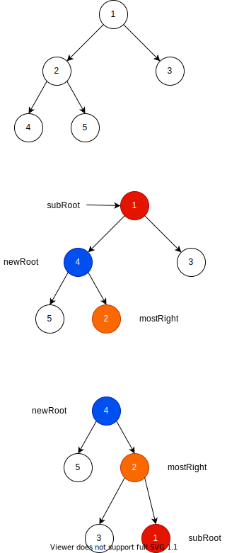

[原题链接](https://leetcode-cn.com/problems/binary-tree-upside-down/)

---

### 0x0 题目详情

>给定一个二叉树，其中所有的右节点要么是具有兄弟节点（拥有相同父节点的左节点）的叶节点，要么为空，将此二叉树上下翻转并将它变成一棵树， 原来的右节点将转换成左叶节点。返回新的根。

---

**测试用例:**

>例子:

输入: [1,2,3,4,5]

            1  
           / \ 
          2   3
         / \   
        4   5   

输出: 返回二叉树的根 [4,5,2,#,#,3,1]

         4
        / \
       5   2
          / \
         3   1  


### 0x1 解题思路

这道题我一开始是想用旋转操作来解决的,但是旋转后的根节点无法向上传递,而且就是怎么旋转都不对，根本无法处理原始根节点的旋转。

后来一看评论区，这道题竟然可以通过找规律解决。

- 首先递归找到最左节点作为新树的根节点newRoot，然后层层向上传递这个新找到的根节点
- 在处理每颗子树时的根节点subRoot时，首先需要找到newRoot构成的树中的最右节点mostRight
- 将subRoot的右节点作为mostRight的左节点
- 将subRoot作为mostRight的右节点
- 递归返回newRoot

如下图所示:



这就是规律,旋转半天也没有找出规律,惭愧。


### 0x2 代码实现

``` java
/**
 * Definition for a binary tree node.
 * public class TreeNode {
 *     int val;
 *     TreeNode left;
 *     TreeNode right;
 *     TreeNode(int x) { val = x; }
 * }
 */
class Solution {
    public TreeNode upsideDownBinaryTree(TreeNode root) {
        if(root==null){
            return root;
        }
        return recur(root);
    }
    private TreeNode recur(TreeNode root){
        if(root.left==null && root.right==null){
            return root;
        }
        TreeNode newRoot=recur(root.left);
        TreeNode mostRight=newRoot;
        while(mostRight.right!=null){
            mostRight=mostRight.right;
        }
        mostRight.left=root.right;
        root.right=null;
        root.left=null;
        mostRight.right=root;
        return newRoot;
    }
}
```

### 0x3 课后总结

类似于旋转、上旋、下旋，找规律是一个不错的思路,在对树做了较多限制的情况下。