[原题链接](https://leetcode-cn.com/problems/count-complete-tree-nodes/)

---

### 0x0 题目详情

>给出一个完全二叉树，求出该树的节点个数。


### 0x1 解题思路

这道题猛的一看还是很简单的奥。不就是求二叉树的节点嘛，递归一哈就完事了。然而事情并没有那么简单。如果只是单纯的使用递归那么并没有用上完全二叉树这个条件。对于完全二叉树，有一种更好的解法。

首先我们需要知道,对于一颗满二叉树，它的节点个数为`2^h-1`，h为树的高度。那么对于完全二叉树，如果根节点的左子树高度与右子树高度不等，那么它的右子树肯定是一颗满二叉树，如下图所示:



那么右子树的节点个数就为:`2^rh-1`，rh为右子树高度，此时 节点总数==左子树节点数+1+`2^rh-1`(1表示的为根节点)。左子树节点可以递归求解。

另外一种情况就是左子树高度和右子树高度是相等的,这跟上面这种情况是差不多的。如下图所示:


可以看到,如果左右子树高度相等的话,左子树一定是一颗满二叉树,所以节点总数=`2^lh-1`+1+右子树节点个数。右子树节点个数通过递归求解可以得到。

### 0x2 代码实现

阶乘肯定是要通过移位求解才是最快的。其实这段代码的时间复杂度也挺难求的，需要用到求递归函数时间复杂度的公式,这里记不太清了,有兴趣的可以到网上找找。
``` java
/**
 * Definition for a binary tree node.
 * public class TreeNode {
 *     int val;
 *     TreeNode left;
 *     TreeNode right;
 *     TreeNode(int x) { val = x; }
 * }
 */
class Solution {
    public int countNodes(TreeNode root) {
        if(root==null){
            return 0;
        }
        int result=0;
        int left=countLevel(root.left);
        int right=countLevel(root.right);
        if(left==right){
            result=countNodes(root.right)+(1<<left);
        }else{
            result=countNodes(root.left)+(1<<right);
        }
        return result;
    }


    private int countLevel(TreeNode root){
        int result=0;
        while(root!=null){
            result++;
            root=root.left;
        }
        return result;
    }
```


### 课后总结

这道题也算是找了一点小小的规律吧。求普通二叉树的节点，求完全二叉树的节点，现在都会咯。
