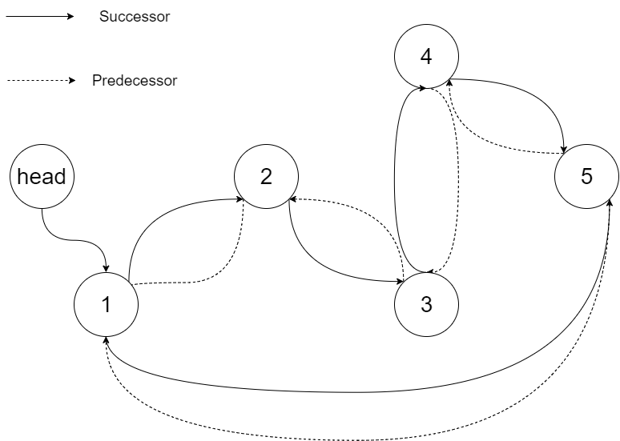

[原题链接](https://leetcode-cn.com/problems/convert-binary-search-tree-to-sorted-doubly-linked-list/)

---

### 0x0 题目详情

>将一个 二叉搜索树 就地转化为一个 已排序的双向循环链表 。
对于双向循环列表，你可以将左右孩子指针作为双向循环链表的前驱和后继指针，第一个节点的前驱是最后一个节点，最后一个节点的后继是第一个节点。
特别地，我们希望可以**就地**完成转换操作。当转化完成以后，树中节点的左指针需要指向前驱，树中节点的右指针需要指向后继。还需要返回链表中最小元素的指针。

---

**测试用例:**

>示例：
输入：root = [4,2,5,1,3] 

输出：[1,2,3,4,5]


解释：下图显示了转化后的二叉搜索树，实线表示后继关系，虚线表示前驱关系。




### 0x1 解题思路

这道题要求不能使用额外空间,那么递归或者使用栈的中序遍历就不能使用了。那么不使用额外空间的遍历树的方法不就是morris遍历嘛。

这题需要首先设置好当前处理节点的左子树最右节点指针。然后在递归回溯时采用中序遍历的方法,将前置节点pre与当前节之间的指针设置好。emmm,感觉口述挺困难的,直接看代码吧。


### 0x2 实现代码

``` java
/*
// Definition for a Node.
class Node {
    public int val;
    public Node left;
    public Node right;

    public Node() {}

    public Node(int _val) {
        val = _val;
    }

    public Node(int _val,Node _left,Node _right) {
        val = _val;
        left = _left;
        right = _right;
    }
};
*/

class Solution {
    public Node treeToDoublyList(Node root) {
        if(root==null){
            return root;
        }
        Node dummy=new Node(-1);
        Node pre=null;
        Node tail=null;
        Node cur=root;
        while(cur!=null){
            
            Node most_right=cur.left;
            if(most_right!=null){
                while(most_right.right!=null && most_right.right!=cur){
                    most_right=most_right.right;
                }
                if(most_right.right==null){
                    most_right.right=cur;
                    cur=cur.left;
                    continue;
                }
            }
            //走到这里,表示当前节点我们已经是第二次遇到了
            //如果前置节点已经设置好了,那么就调整以下pre与cur之间的指针
            if(pre!=null){
                cur.left=pre;
                //这一句是为了防止没有左子树的节点出现
                pre.right=cur;
            }
            if(pre==null){
                dummy.right=cur;
            }
            pre=cur;
            tail=cur;
            cur=cur.right;


        }
        //最后设置以下头节点与尾节点之间的指针
        dummy.right.left=tail;
        tail.right=dummy.right;
        return dummy.right;
    }
}
```

### 0x3 课后总结

不需要耗费额外空间的二叉树遍历就是Morris遍历。

