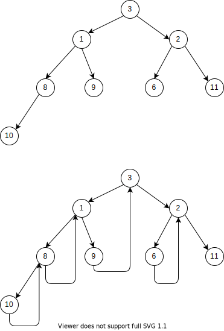

[原题链接](https://leetcode-cn.com/problems/recover-binary-search-tree/)

---

### 0x0 题目详情

> 二叉搜索树中的两个节点被错误地交换。
请在不改变其结构的情况下，恢复这棵树。

>进阶:
使用 O(n) 空间复杂度的解法很容易实现。
你能想出一个只使用常数空间的解决方案吗？

### 0x1 解题思路

这道题如果使用常规的中序遍历去做的话，无论是迭代版本还是递归版本，都会产生O(N)的空间复杂度。当然常规方法其中有一点我没有想到的就是会产生一组逆序对或者两组逆序对(因为这道题限制了只有两个数出现错误，所以至多只会出现两组)，单纯的找出一组逆序对不太行。产生两组逆序对的情况就是这三个数(两组逆序对)的首尾需要交换。比如3、2、1这种情况。当然出现一组逆序对就直接交换就好了。

正确做法应该是采用morris遍历，空间复杂度为O(1),因为这种方法的遍历不再需要空间记录回溯的位置，会利用空闲的右指针来记录。morris遍历说来也简单，就是如果一颗树有左子树，那么我们需要找到该左子树的最右节点，此时一定为null，将其指向当前树的根节点后继续遍历左子树，如果没有左子树，那么直接遍历右子树。

采用上述的方法，如果一个节点有左子树，那么最后一定会来到该节点两次，第二次是通过先前设置的左子树的最右节点到达。代码实现也非常简单(Morris遍历是不需要递归的)。

``` java "Morris的简单遍历"
class TreeNode{
    TreeNode left;
    TreeNode right;
    int val;
}

void Morris(TreeNode root){
    TreeNode cur=root;
    TreeNode most_right=null;
    
    while(cur != null){
        most_right=cur.left;
        if(most_right!=null){
            while(most_right!=null && most_right!=cur){
                //找到左子树的最右节点
                most_right=most_right.right;
            }
            if(most_right == null){
                //首次将最右指针指向当前节点
                most_right.right=cur;
                cur=cur.left;
                continue;
            }else{
                //第二次遇到最右指针了，就需要把它恢复成null
                most_right.right=null;
            }
        }
        //已经没有左子树了，直接走向右子树就可
        cur=cur.right;
    }
}
```

如果我们使用上述方法每遇到一个节点就打印出来，以下图为例：

遍历顺序如下:3[1]、1[1]、8[1]、10、8[2]、1[2]、9、3[2]、2[1]、6、2[2]、11,其中[1]表示第一次遇到，[2]表示第二次遇到。

#### 前序遍历

上面这颗树的前序遍历为:3、1、8、10、9、2、6、11，这通过morris遍历很容易得到。如果一个能遇到两次，那么我们只取第一次；如果一个只能遇到第一次，那当然就只取第一次了。代码就从上面的改改就好了。

``` java "Morris前序遍历"
class TreeNode{
    TreeNode left;
    TreeNode right;
    int val;
}

void Morris(TreeNode root){
    TreeNode cur=root;
    TreeNode most_right=null;
    
    while(cur != null){
        most_right=cur.left;
        if(most_right!=null){
            while(most_right!=null && most_right!=cur){
                //找到左子树的最右节点
                most_right=most_right.right;
            }
            if(most_right == null){
                //首次将最右指针指向当前节点，第一次遇到
                most_right.right=cur;

                System.out.println(cur.val);

                cur=cur.left;
                continue;
            }else{
                //第二次遇到最右指针了，就需要把它恢复成null
                most_right.right=null;
            }
        }
        //已经没有左子树了，直接走向右子树就可
        //如果不加else，那么走到这情况有可能是从if里跳出来，也有可能是直接没进入if
        //那么这里只需要打印只能来到自己一次的节点，也就是直接没进入if的情况
        else{
            System.out.println(cur.val);
        }
        cur=cur.right;
    }
}

```

ok,前序遍历已经完成了，还是挺简单的。

#### 中序遍历

这棵树的中序遍历结果为10、8、1、9、3、6、2、11。从morris遍历里中，如果一个节点能遍历两边，那么我们只用取第二遍，如果一个节点只能遍历一次，那么肯定也只取这一次了。

``` java "Morris中序遍历"
class TreeNode{
    TreeNode left;
    TreeNode right;
    int val;
}

void Morris(TreeNode root){
    TreeNode cur=root;
    TreeNode most_right=null;
    
    while(cur != null){
        most_right=cur.left;
        if(most_right!=null){
            while(most_right!=null && most_right!=cur){
                //找到左子树的最右节点
                most_right=most_right.right;
            }
            if(most_right == null){
                //首次将最右指针指向当前节点，第一次遇到
                most_right.right=cur;

                //System.out.println(cur.val);

                cur=cur.left;
                continue;
            }else{
                //第二次遇到最右指针了，就需要把它恢复成null
                most_right.right=null;
            }
        }
        //已经没有左子树了，直接走向右子树就可
        //如果不加else，那么走到这情况有可能是从if里跳出来（第二次遇到了），也有可能是直接没进入if(第一次遇到了)
        //那么这里只需要打印只能来到自己一次的节点，也就是直接没进入if的情况
        System.out.println(cur.val);
        cur=cur.right;
    }
}

```

#### Morris后序遍历

后续遍历有点麻烦，不像中序和前序比较简单，具体规则如下：

当第二次来到该节点时，因为我们需要把左子树的最右节点设为null，就在设null的时候，我们逆序打印当前节点左子树的那一liu右节点，比如在上图中，我们第二次来到节点3，我们需要逆序打印左子树的一liu右节点，也就是1、9,逆序大因为9、1。

并且在最后需要逆序打印根节点的那一liu右节点。

``` java
class TreeNode{
    TreeNode left;
    TreeNode right;
    int val;
}

void Morris(TreeNode root){
    TreeNode cur=root;
    TreeNode most_right=null;
    
    while(cur != null){
        most_right=cur.left;
        if(most_right!=null){
            while(most_right!=null && most_right!=cur){
                //找到左子树的最右节点
                most_right=most_right.right;
            }
            if(most_right == null){
                //首次将最右指针指向当前节点，第一次遇到
                most_right.right=cur;

                //System.out.println(cur.val);

                cur=cur.left;
                continue;
            }else{
                //第二次遇到最右指针了，就需要把它恢复成null
                most_right.right=null;
                printEdge(cur.left);
            }
        }
        //已经没有左子树了，直接走向右子树就可
        //如果不加else，那么走到这情况有可能是从if里跳出来（第二次遇到了），也有可能是直接没进入if(第一次遇到了)
        //那么这里只需要打印只能来到自己一次的节点，也就是直接没进入if的情况
        //System.out.println(cur.val);
        cur=cur.right;
    }
    //最后逆序打印根节点的右子树
    printEdge(root);
}

void printEdge(TreeNode head){
    TreeNode pre=null;
    TreeNode next=null;
    while(head!=null){
        next=head.right;
        head.right=pre;
        pre=head;
        head=next;
    }
    //打印链表
    TreeNode tail=pre;
    while(pre!=null){
        System.out.println(pre.val);
    }
    //恢复原来的指针
    next=null;
    while(tail!=null){
        next=tail.right;
        tail.right=pre;
        pre=tail;
        tail=next;
    }
    return pre;
}
```
### 0x2 代码实现

有了上面的基础，我们就很容易写出空间复杂度为O(1)的中序遍历。

``` java
/**
 * Definition for a binary tree node.
 * public class TreeNode {
 *     int val;
 *     TreeNode left;
 *     TreeNode right;
 *     TreeNode() {}
 *     TreeNode(int val) { this.val = val; }
 *     TreeNode(int val, TreeNode left, TreeNode right) {
 *         this.val = val;
 *         this.left = left;
 *         this.right = right;
 *     }
 * }
 */
class Solution {
    public void recoverTree(TreeNode root) {
        if(root==null){
            return;
        }
        TreeNode pre=null;
        TreeNode t1=null,t2=null;
        TreeNode mostRight=null;
        while(root!=null){
            mostRight=root.left;
            //有左分支就一路左下到底
            if(mostRight!=null){
                while(mostRight.right!=null && mostRight.right!=root){
                    mostRight=mostRight.right;
                }
                if(mostRight.right==null){
                    mostRight.right=root;
                    root=root.left;
                    continue;
                }
                else{
                    mostRight.right=null;
                }
            }
            if(pre!=null && pre.val >= root.val){
                //如果有两组逆序对，第一个节点t1不为空时就不需要发生变化了,t2需要更新为最新逆序对的第二个值
                if(t1==null){
                    t1=pre;
                }
                //不断更新t2
                t2=root;
            }
            pre=root;
            root=root.right;
        }
        int temp=t1.val;
        t1.val=t2.val;
        t2.val=temp;
        return;
    }
}
```

### 0x3 课后总结

怎么说呢，BST就是中序遍历关系很紧密，Morris遍历只适用于不需要从左树、右树获取信息然后再决定当前如何操作的情况。